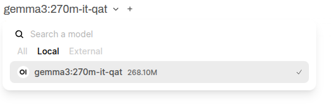
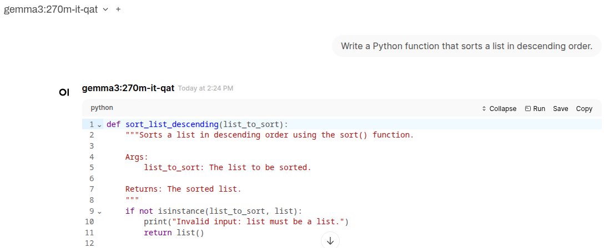
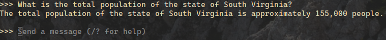

# Local LLM inference with Ollama and Llama.cpp
*Adapted from a [C.Psyd](https://c-psyd.github.io/) tutorial given 9/12/25*

This tutorial will guide you through the installation, setup, and basic usage of the Ollama and Llama.cpp CLI tools. 

You may have used HuggingFace `transformers` for running "small" pretrained langugage models like BERT or GPT-2. However, it can be much simpler to use tools like Ollama or Llama.cpp when working with large generative models. They allow you to easily:
* "split" a large model across VRAM and CPU RAM,
* enable things like flash attention,
* run quantized models,
* interact with an LLM using a chat interface, and
* prompt the model using the OpenAI API.

This is a high-level introduction focused on running LLMs on your laptop or personal computer. Of course, you might also want to make use of Cornell's G2 cluster, if you have access. In that case, you should review the [G2 docs](https://it.coecis.cornell.edu/researchit/g2cluster/) and how to [use SLURM](https://it.coecis.cornell.edu/researchit/g2cluster/#:~:text=Create%20a%20SLURM%20Submission%20Script%3A). 

### Disclaimer
Install and use these tools at your own risk. It's possible to damage your machine running models that are too large for too long. You should be familiar with the limitations and capabilities of your hardware before trying to download and run a model.

## Ollama
### 1. Ollama installation
Installing Ollama is very easy.
#### Linux
Run
```
curl -fsSL https://ollama.com/install.sh | sh
```
#### Mac & Windows
Download and run the appropriate installation file [here](https://ollama.com/download).

### 2. [Open WebUI](https://docs.openwebui.com/) Setup
Open WebUI is an offline, browser-based chat interface for interacting with LLMs. If you've used ChatGPT before, it's interface should feel very familiar. 

#### Linux/MacOS
First, install [`uv`](https://docs.astral.sh/uv/), "a Python package and project manager, written in Rust":
```
curl -LsSf https://astral.sh/uv/install.sh | sh
```
Then, when you want to run Open WebUI, all you need to do is run 
```
DATA_DIR=~/.open-webui uvx --python 3.11 open-webui@latest serve
```
The first time you run this, it will download and install all of the Open WebUI dependencies into an isolated environment. Every subsequent time you run it, `uvx` will recreate this environment and install the latest version of Open WebUI into it using cached files, downloading any new dependencies as needed. Read more about `uvx` [here](https://docs.astral.sh/uv/guides/tools/).

Since you probably don't want to type this long command out every single time you run it, consider adding something like this to your `.bashrc`/`.zshrc` (Linux) or `.bash_profile` file (Mac):
```
alias open-webui="DATA_DIR=~/.open-webui uvx --python 3.11 open-webui@latest serve"
```
There are also `uv`-specific ways of doing this, that you can read about in the docs.

Now, if Open WebUI is running, open your web browser and navigate to `http://localhost:8080`. Create an account and you should see a chat interface!

#### Windows (Powershell)
Install `uv`:
```
powershell -ExecutionPolicy ByPass -c "irm https://astral.sh/uv/install.ps1 | iex"
```
To run Open WebUI, run 
```
$env:DATA_DIR="C:\open-webui\data"; uvx --python 3.11 open-webui@latest serve
```
*I don't know how you set aliases in Powershell, but you can probably figure that part out on your own.*

Navigate to `http://localhost:8080`, create an account, and you're good to go!

### 3. Downloading Models
Ollama might have installed a small model by default. To check what models you currently have installed, run
```
ollama list
```
If you have models installed, you should see a table with lines like:
```
NAME                                ID              SIZE      MODIFIED 
deepseek-r1:8b-0528-qwen3-q4_K_M    6995872bfe4c    5.2 GB    13 days ago
```

Ollama makes it easy to download new models. Let's try downloading a small, quantized Gemma 3 model, `gemma3:270m-it-qat`. Typically on Ollama, the particular [GGUF](https://huggingface.co/docs/hub/en/gguf) file you're downloading has the model name first, a `:` character, the model size, and then any model variant and quantization. Here, we have 
* `gemma3`: the model family,
* `270`: parameter count,
* `it`: instruction tuned, 
* `qat`: quantized using [Quantization Aware Training](https://pytorch.org/blog/quantization-aware-training/).

To download this model, just run 
```
ollama pull gemma3:270m-it-qat
```
Now, when you run `ollama list`, you should see the model, its size, and when it was last modified. If you ever want to remove a model, just run 
```
ollama rm model:name
```
where `model:name` is the name of the model you want to remove. 

### 4. Chatting with your model
Let's put all these steps together to chat with our model.

First, start your `ollama` server. It may already be started, depending on your OS/when you installed Ollama. Try running
```
ollama serve
```
If you get an error like
```
Error: listen tcp 127.0.0.1:11434: bind: address already in use
```
it's already running.

If it's not already running, in another terminal window, run Open WebUI. Use your custom alias or with the same command you used to "install" it the first time,
```
DATA_DIR=~/.open-webui uvx --python 3.11 open-webui@latest serve
```

In your web browser, navigate to `localhost:8080`. 

In the upper left hand corner of the screen, you should see a model name. Select "Local" and then the `gemma3:270m-it-qat` model we downloaded earlier.



Now you can chat with this (small, probably disappointing) LLM just like you would with any externally-hosted model.



If you ever want to test a model without using Open WebUI, you can use Ollama in a terminal window like so:
```
ollama run gemma3:270m-it-qat
```


This is nice if you just want to quickly check how well a model runs on your machine or test out an idea. 

## Llama.cpp
Llama.cpp is a slightly less user-friendly but very powerful command line tool for running language models. As an example, we're going to demonstrate how to serve an LLM using Llama.cpp and prompt it using the `openai` Python package. 

### 1. Installation
We're going to assume you'll install it using a package manager. You should look at the documentation for these package managers if you aren't already familiar with them.

#### Linux/Mac
With [Homebrew](https://brew.sh) (Mac/Linux):
```
brew install llama.cpp
```
With [Nix](https://nix.dev/manual/nix/2.28/) (Linux/Mac):
```
nix profile install nixpkgs#llama-cpp
```
With [MacPorts](https://www.macports.org/) (Mac): 
```
sudo port install llama.cpp
```

For Arch-based systems, you can find hardware-specific versions of Llama.cpp available on the AUR. This may not be ideal, but works fine in my experience.

#### Windows
With [Winget](https://github.com/microsoft/winget-cli):
```
winget install llama.cpp
```

After installing, you'll be able to use to `llama-cli`, `llama-server`, `llama-perplexity`, `llama-bench`, `llama-run`, and `llama-simple`. If you're curious about any of these tools, just run them with the `--help` flag or look at the [docs](https://github.com/ggml-org/llama.cpp?tab=readme-ov-file). (For CPsyders, `llama-perplexity` might be particularly useful).

### 2. `llama-server` 
Let's serve a small Qwen3 model, `Qwen3-0.6B` using `llama-server`. To download the model start the server, run
```
llama-server -hf Qwen/Qwen3-0.6B-GGUF:Q8_0 --jinja --reasoning-format deepseek -ngl 99 -fa -sm row --temp 0.6 --top-k 20 --top-p 0.95 --min-p 0 -c 40960 -n 32768 --no-context-shift
```
You should look at the [Llama.cpp HTTP Server docs](https://github.com/ggml-org/llama.cpp/tree/master/tools/server) to find out what all these arguments do. While we're not doing anything all that different from what we would with Ollama, you can specify the number of layers on GPU with `-ngl`, turn on flash attention with `-fa`, and change sampling parameters (`--temp`, `--top-k`, `--top-p`, etc.). 

When you run the command above, you should see a download progress bar, followed by a chat template and the following: 
```
main: server is listening on http://127.0.0.1:8080 - starting the main loop
srv  update_slots: all slots are idle
```
Now we can use the URL above, `http://127.0.0.1:8080` (or whatever it might be on your installation), with the `openai` Python library. (However, you can also just [use `curl`](https://github.com/ggml-org/llama.cpp/tree/master/tools/server#:~:text=...%20or%20raw%20HTTP%20requests%3A).)

### 3. Prompting 
Take a look at the `example.py` file in this repo. The important thing to notice is how we initialize the `openai` client:
```
import openai 

client = openai.OpenAI(
        base_url="http://127.0.0.1:8080/v1",
		api_key="sk-no-key-required"
    )
```
When using OpenAI's products, we usually omit the `base_url` argument. What we're doing here is just pointing the `openai` libraries requests to the model running on `llama-server` instead of OpenAI's servers. Note the `/v1` at the end of the URL; the docs say to include this, but it actually doesn't matter for this model. For this reason, we don't need an API key (you can omit this entirely if you have your OpenAI API key set as an environmental variable); this is just a placeholder value.

To prompt, we use the [Chat Completions](https://platform.openai.com/docs/api-reference/chat) endpoint like so:
```
messages = [
        {"role": "system", "content": "You are a Linguistics Professor at Cornell named Marty."},
        {"role": "user", "content": "Tell me what you think about LLMs as models of human language processing"}
    ]

output = client.chat.completions.create(
	model="GPT-6",
    messages=messages
)
output = output.choices[0].message
```
What you use for the `model` doesn't matter here; the `create` method just expects it and complains if you don't include it.

Since we have `uv` installed, we can run this script without permanently installing anything or creating a new environment. We can just use 
```
uv run --with openai example.py
```
In the terminal window with `llama-server` still running, you should see something like 
```
srv  params_from_: Chat format: Hermes 2 Pro
slot launch_slot_: id  0 | task 0 | processing task
slot update_slots: id  0 | task 0 | new prompt, n_ctx_slot = 40960, n_keep = 0, n_prompt_tokens = 39
slot update_slots: id  0 | task 0 | kv cache rm [0, end)
slot update_slots: id  0 | task 0 | prompt processing progress, n_past = 39, n_tokens = 39, progress = 1.000000
slot update_slots: id  0 | task 0 | prompt done, n_past = 39, n_tokens = 39
slot      release: id  0 | task 0 | stop processing: n_past = 644, truncated = 0
slot print_timing: id  0 | task 0 |
prompt eval time =      26.51 ms /    39 tokens (    0.68 ms per token,  1471.20 tokens per second)
       eval time =    2577.41 ms /   606 tokens (    4.25 ms per token,   235.12 tokens per second)
      total time =    2603.91 ms /   645 tokens
```
Then, in the window where you ran the Python script, you should see the model's reasoning and response as standard output. Nice! 

## Wrapping up
I hope this tutorial showed how easy it is to get models running locally and have inspired to you to learn these tools and build something interesting! This is barely scratching the surface. Please check out the [Ollama](https://github.com/ollama/ollama/tree/main/docs) and [Llama.cpp](https://github.com/ggml-org/llama.cpp?tab=readme-ov-file) docs to learn about all of the other things you can do with these tools. If you have a decent amount of RAM, you might even be able to [run gpt-oss 20b](https://github.com/ggml-org/llama.cpp/discussions/15396), which performs similarly to GPT-4o-mini. 
